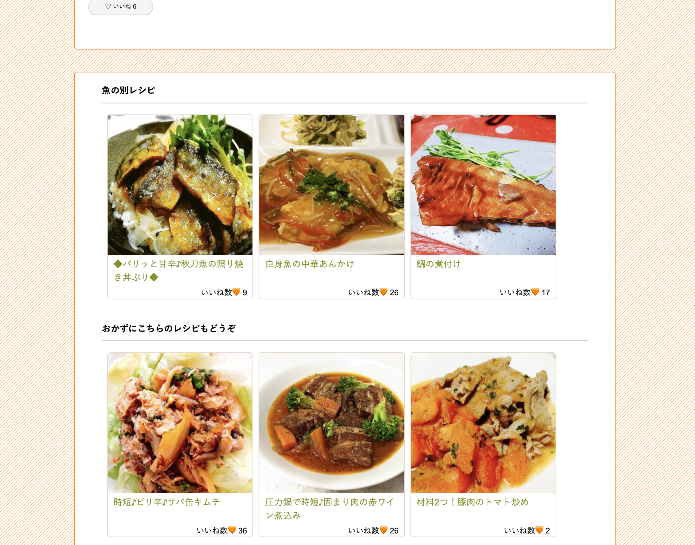

# 概要
- Bon Repasという料理のレシピアプリを作成しました。
- Bon Repasはフランス語で「美味しい食事」という意味です。

## 背景
- このアプリを作成しようと思ったきっかけは、毎日の料理の献立を考えるのが大変という実体験を元に作成しようと思いました。
- このレシピアプリを使うことによって、献立を考える時間を減らす事が出来るようにしたいという思いで作成に至りました。

## 実装した機能
- ユーザーの新規登録
  - ユーザーの新規登録を行う事で、レシピの投稿やいいねをする事ができます。
  - レシピの閲覧のみであれば、会員登録は不要です。
- レシピの投稿
  - サイトにレシピの投稿をする事が出来ます。
  - 画面に表示されている項目を入力する事でレシピの投稿が出来ます。
  - 食材や工程の入力フォームは、「追加」ボタンを押す事で必要に応じて増やす事が出来ます。

  - マイページにて投稿したレシピの「編集」と「削除」が出来ます。
- 検索機能
  - 検索ボックスからレシピの検索をする事が出来ます。
  - 検索の方法は、料理名や食材、カテゴリーでの検索、いいねが多い順やランダムでの検索が可能です。
- いいね機能
  - ログインをしている状態ならレシピにいいねをする事が出来ます。
  - マイページにて、自分がいいねをしたレシピの履歴を一覧で見る事が出来ます。

## 工夫
- jQueryを用いて動的なサイトにしたこと。
  - トップページのレシピが5秒毎に切り替わるようにしています。
  - 様々なレシピを表示させて、ユーザーの目に止まりやすくなるようにしています。

  - マウススクロールによって、レシピがフェードインをするようにしています。

- 関連レシピの表示をしたこと。
  - レシピ詳細ページの下部にて、同じカテゴリーのレシピとおかずのレシピをランダムで表示するようにしています。
  - おかずのレシピはメイン料理を作っている間の一手間で出来るようなレシピを表示するようにしており、料理の品数を増やせるようにしています。

- レシピをランダムで表示するようにしたこと。
  - トップページや関連で表示されるレシピはランダムで表示をするようにしています。
  - サイトを訪れる度に色々なレシピを見てもらえるようにするためです。
- レスポンシブ対応にしたこと。
  - PCだけでなく他のデバイスで表示をした時のビューの崩れを防ぐためにレスポンシブ対応にしています。
    - PCサイズでの表示

    - タブレットサイズでの表示

## その他
- 制作期間
  - 1週間弱

- ER図

